---

layout: yandex2

style: |
    /* собственные стили можно писать здесь!! */


---

# {:.logo}

## {{ site.presentation.title }}
{:.title}

### {{ site.presentation.service }}



{:.nda}


<div class="authors">

<p>{{ site.author.name }}, {{ site.author.position }}</p>



<p>{{ site.author2.name }}, {{ site.author2.position }}</p>


</div>

## Что вас ждет

1. {:.next}О задании
2. {:.next}Как сверстать
3. {:.next}Дополительные критерии
4. {:.next}Ответы на вопросы

## О задании
{:.section}

## 0. Нужно сверстать по макетам две страницы сервиса "Переговорки"
{:.fullscreen}

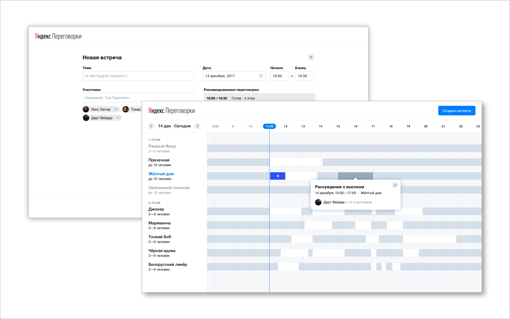

## 1. Адаптивная верстка
{:.fullscreen}

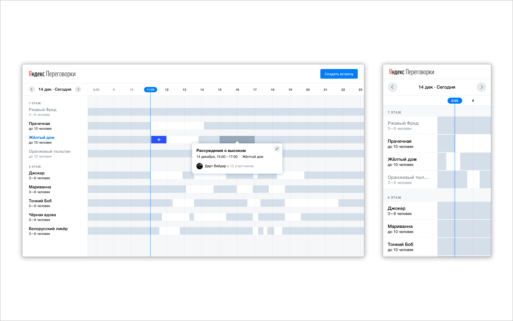

## 2. Кроссбраузерность
{:.fullscreen}

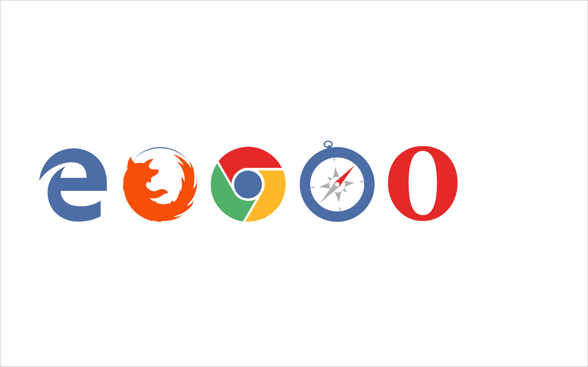

## 2. Кроссбраузерность
{:.fullscreen}

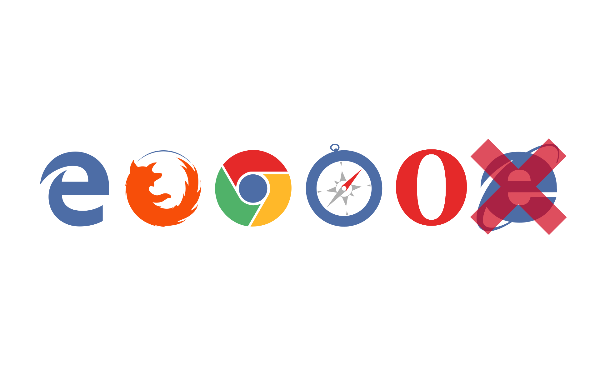

<!-- ## 2. Кроссбраузерность
{:.fullscreen}

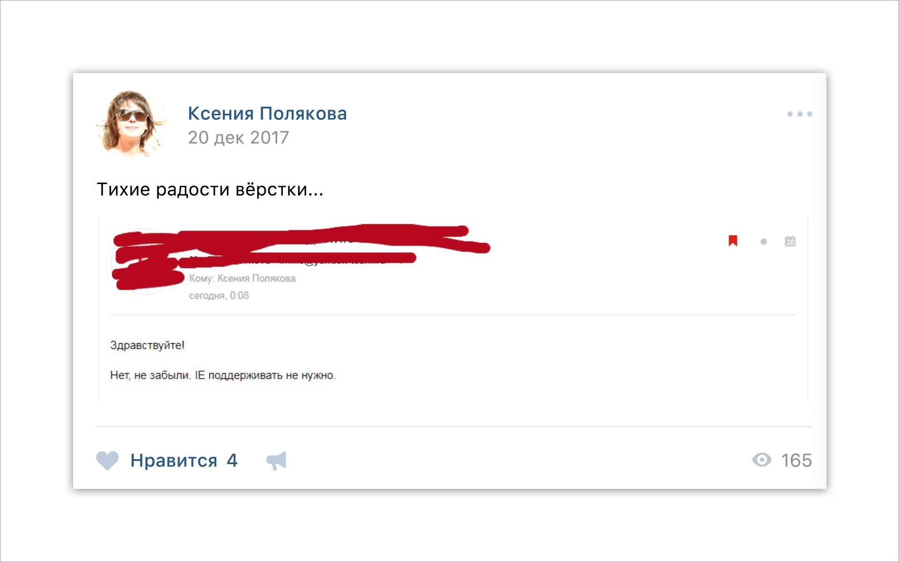
-->

## Почему переговорки?
{:.section}

## Почему переговорки?
{:.fullscreen}

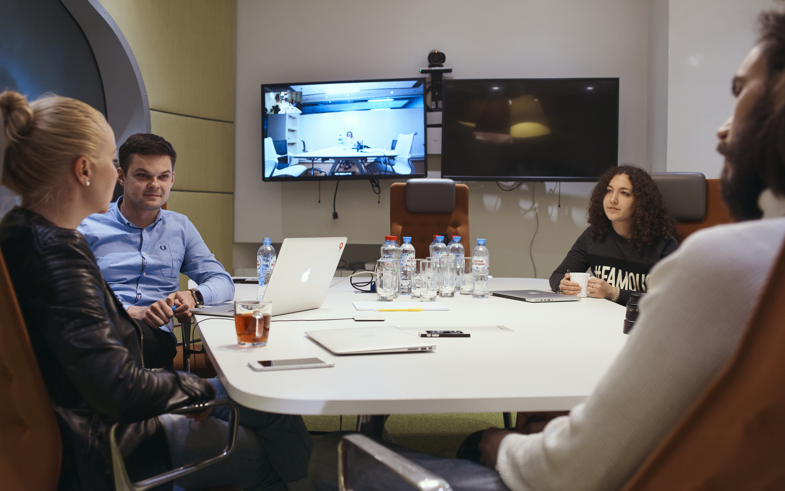

## Почему макеты?
{:.section}

## Дизайнеры
{:.images .three}


*Ольга Шанцева*


*Даша Мартынюк*


*Регина Смирнова*

## Черновики - десктоп
{:.fullscreen}

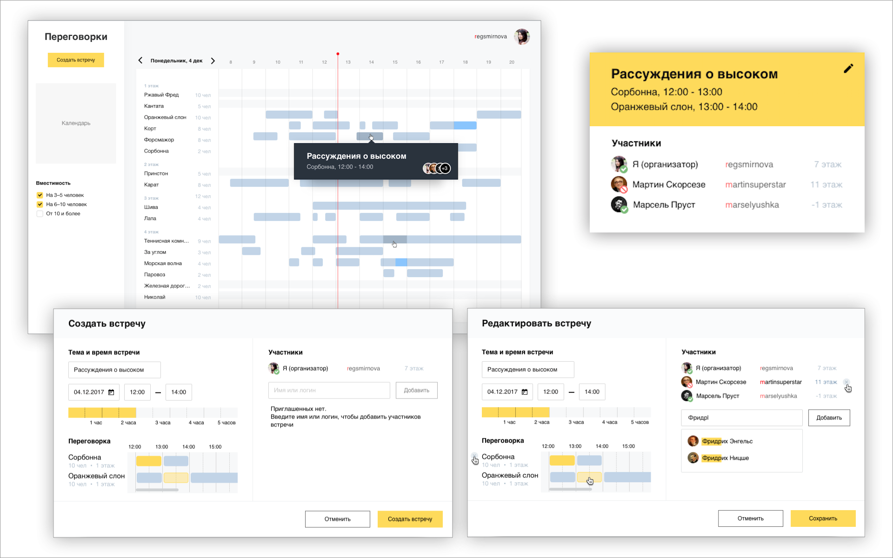

## Черновики - мобилки
{:.fullscreen}

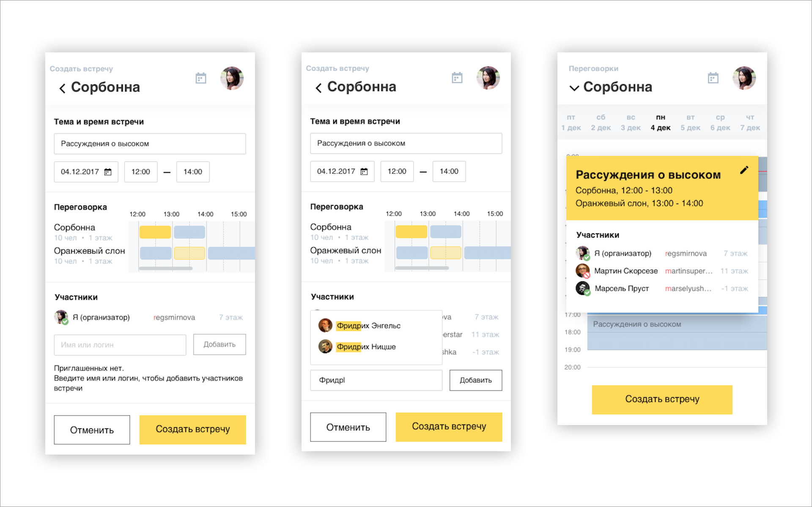

## В итоге &mdash; сложные качественные макеты.
{:.blockquote}

## Как сверстать
{:.section}

## Смотрим макет - desktop
{:.fullscreen}

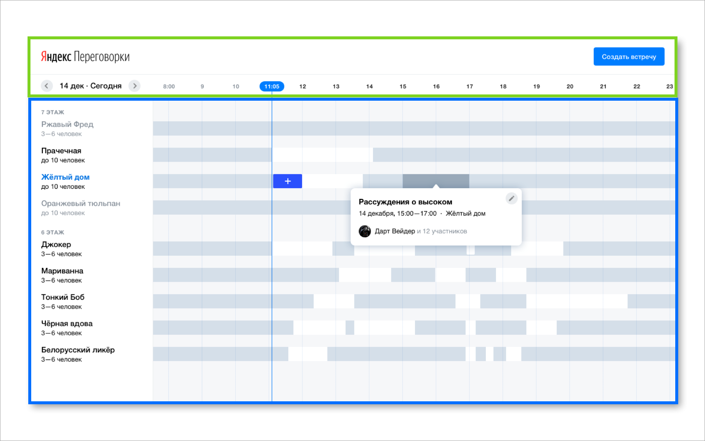

## Смотрим макет - touch
{:.fullscreen}

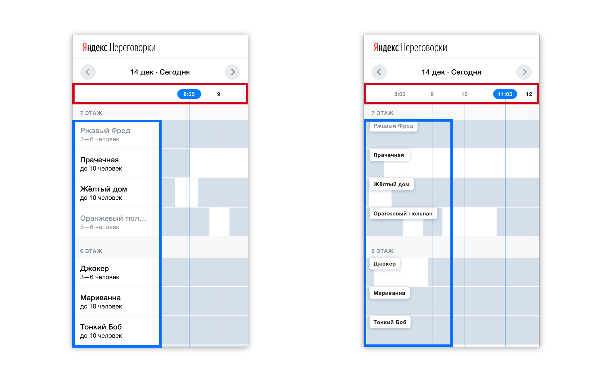

## 1. Разметка страницы
{:.section}

### Как сверстать

## Схема решения - X - 00
{:.fullscreen}

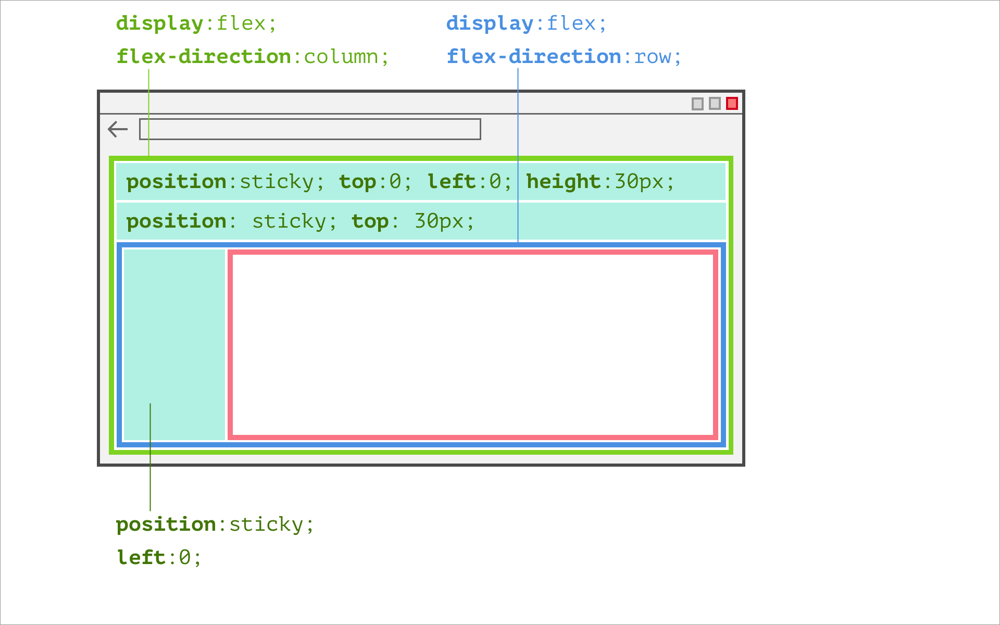

## Схема решения - X - 01
{:.fullscreen}

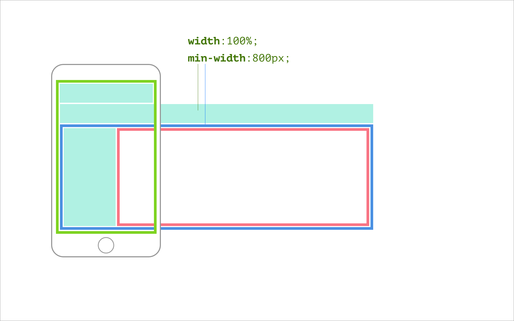

## [example](https://dima117.github.io/task2/pages/v1-index-layout/index.html)
{:.shout}

## [ngrok.com](https://ngrok.com/)<br/><br/>[localtunnel.github.io](https://localtunnel.github.io/www/)
{:.shout}

## Схема решения - X - 02
{:.fullscreen}

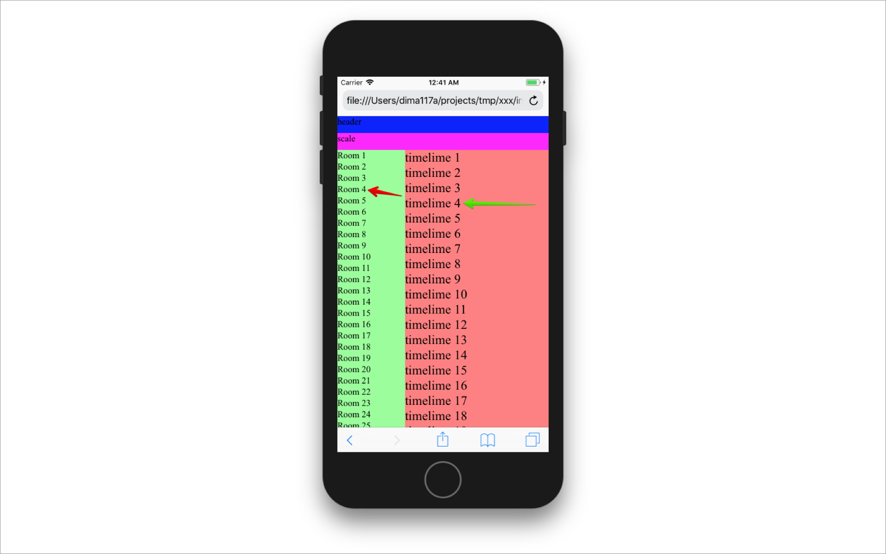

## Схема решения - X - 03
{:.fullscreen}

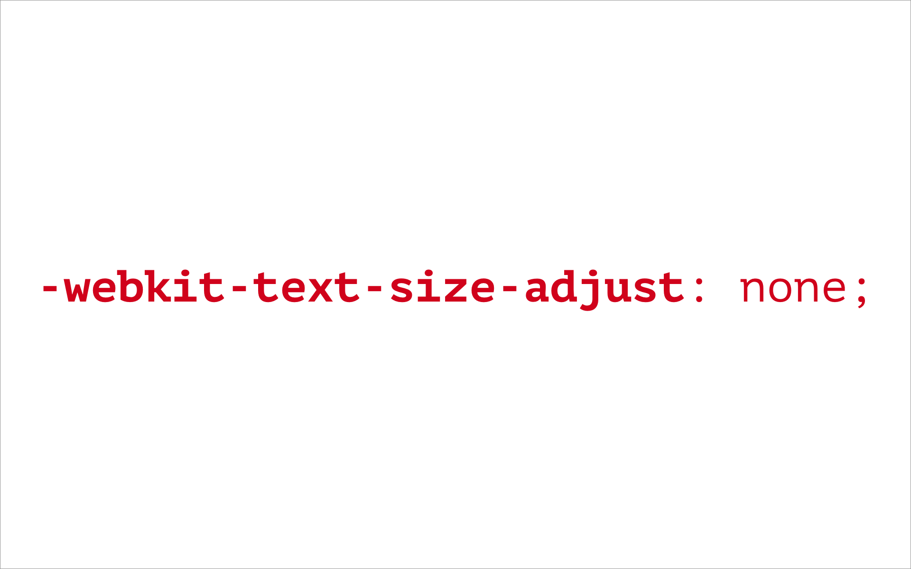

## [CSS и iOS Safari](https://habrahabr.ru/post/332872/)
{:.shout}

## 2. Шкала времени
{:.section}

### Как сверстать

## Шкала - 00
{:.fullscreen}

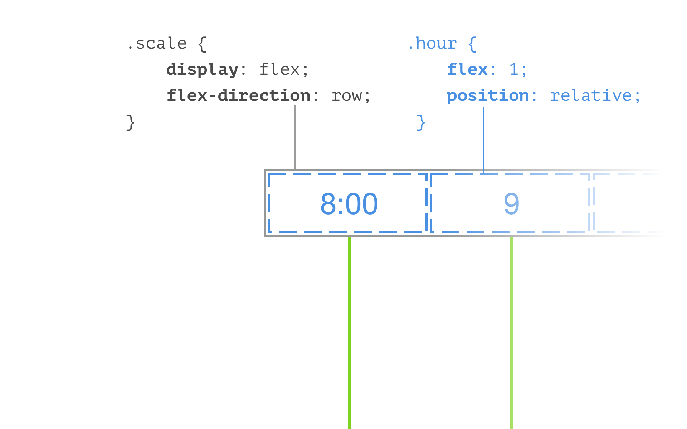

## Шкала - 01
{:.fullscreen}

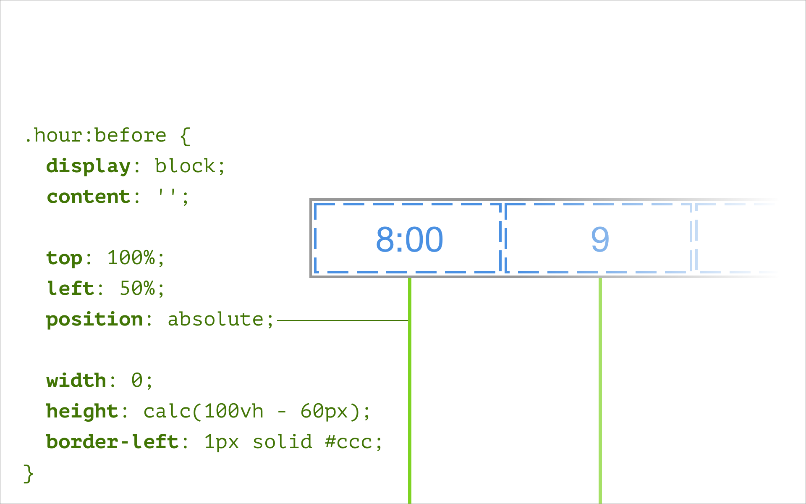

## [example](https://dima117.github.io/task2/pages/v2-index-scale/index.html)
{:.shout}

## 3. Названия переговорок
{:.section}

### Как сверстать

## Смотрим макет - touch
{:.fullscreen}


## Навешиваем класс при скролле
{:.fullscreen}

```js
// область, в которой происходит скролл
var page = document.querySelector('.page');

// панель с названиями переговорок
var aside = document.querySelector('.aside');

page.addEventListener('scroll', function () {
    // если позиция скролла больше ширины панели,
    // добавляем класс 'aside--float'
    aside.classList.toggle('aside--float', page.scrollLeft > 120);
}); 
```

## Стили для панели с названиями
{:.fullscreen}

```css
...

.aside--float {

  position: sticky;

  visibility: hidden;
}

.aside--float .room-name {

  display: inline-block;
  
  visibility: visible;
}
```

## [example](https://dima117.github.io/task2/pages/v3-index-names/index.html)
{:.shout}

## 4. Timeline
{:.section}

### Как сверстать

## Иллюстрация

## [example](https://dima117.github.io/task2/pages/v4-index-timeline/index.html)
{:.shout}

## Цикл в CSCC
{:.fullscreen}

```css
...

@for $h from 0 through 15 {

  @for $m from 0 through 3 {

    .event-slot--#{$h}h#{$m*15}m {
      
      width: (100% / 16 * $h)   // часы 
           + (100% / 64 * $m);  // минуты
    }
  }
}
```

## Классы
{:.fullscreen}

```css
...

.event-slot--1h0m { width: 6.25%; }

.event-slot--1h15m { width: 7.8125%; }

.event-slot--1h30m { width: 9.375%; }

.event-slot--1h45m { width: 10.9375%; }

.event-slot--2h0m { width: 12.5%; }

.event-slot--2h15m { width: 14.0625%; }

.event-slot--2h30m { width: 15.625%; }

...
```

## [example](https://www.sassmeister.com/gist/59bc49df90effefe881d9b70cedac9ce)
{:.shout}

## 5. Форма
{:.section}

### Как сверстать

## [example](https://dima117.github.io/task2/pages/v5-form-layout/form.html)
{:.shout}

## Дополнительные критерии
{:.section}

## Организация и оформление кода

1. {:.next}Разбит ли код на части и насколько логично разбиение
2. {:.next}Одинаковое оформление кода

```


    $ npm install -g stylelint

    $ stylelint "foo/**/*.scss" --syntax scss
```
{:.next}

## Автоматизация

1. {:.next}autoprefixer
2. {:.next}препроцессоры
  - константы
  - циклы
  - сборка (`@import`)
3. {:.next}оптимизация (dev/prod режимы)


## NPM INSTALL
{:.fullscreen}

```


$ npm install --save-dev gulp
$ npm install --save-dev gulp-autoprefixer
$ npm install --save-dev gulp-sass
$ npm install --save-dev gulp-clean-css
```

## GULPFILE
{:.fullscreen}

```js
// gulpfile.js

const gulp = require('gulp');
const sass = require('gulp-sass');
const autoprefixer = require('gulp-autoprefixer');
const cleanCss = require('gulp-clean-css');

gulp.task('sass', function () {
  return gulp.src('./sass/**/*.scss')
    .pipe(sass())
    .pipe(autoprefixer({
      browsers: ['last 2 versions']
    }))
    .pipe(cleanCss())
    .pipe(gulp.dest('./css'));
});
```

## Вопросы?
{:.section}

## Спасибо
{:.contacts}



<figure markdown="1">

### {{ site.author.name }}


{{ site.author.position }}


</figure>





<figure markdown="1">

### {{ site.author2.name }}


{{ site.author2.position }}


</figure>



<!-- разделитель контактов -->
-------

<!-- left -->
- {:.skype}dima117a
- {:.mail}dima117a@yandex-team.ru
- {:.github}dima117

<!-- right -->


<!-- 
- {:.twitter}@author
- {:.facebook}author
- {:.mail}author@yandex-team.ru
- {:.phone}+7-999-888-7766
- {:.github}author
- {:.bitbucket}author
- {:.twitter}@author
- {:.telegram}author
- {:.skype}author
- {:.instagram}author
- {:.facebook}author
- {:.vk}@author
- {:.ok}@author

-->
