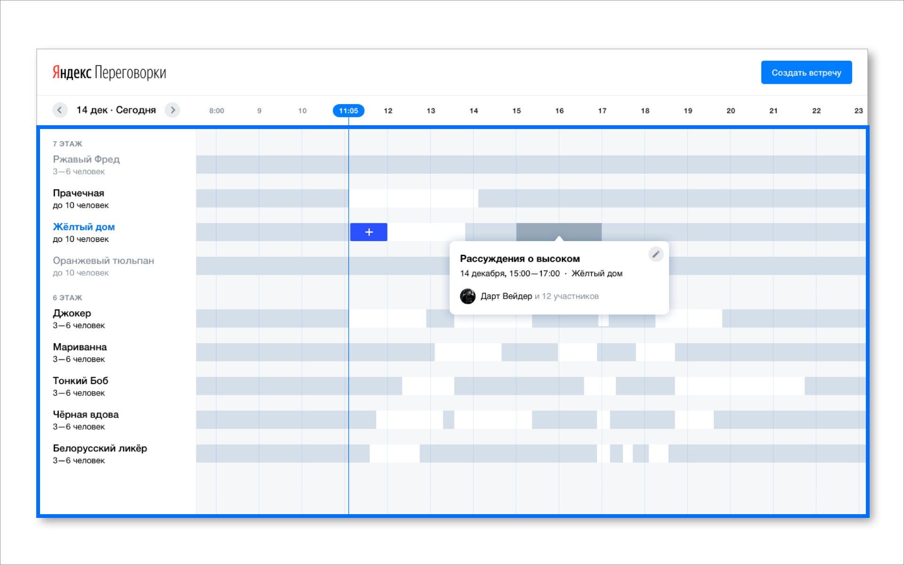
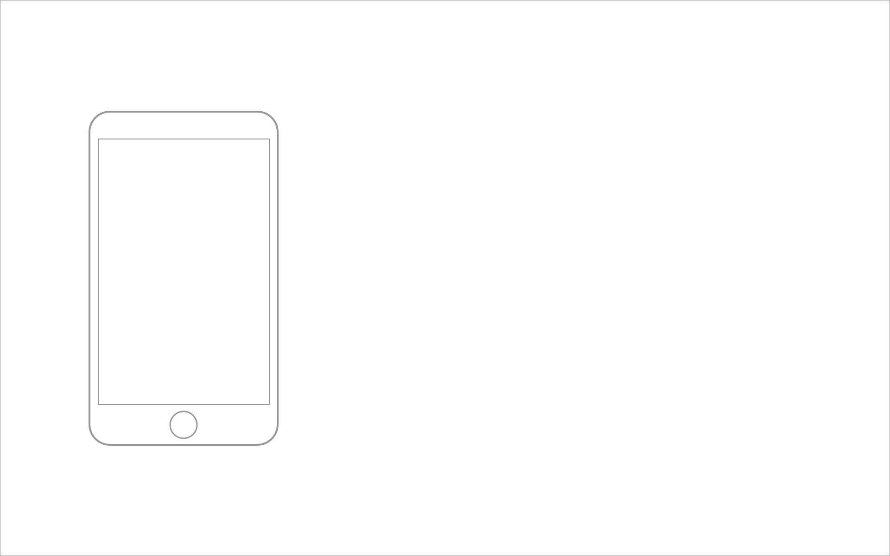
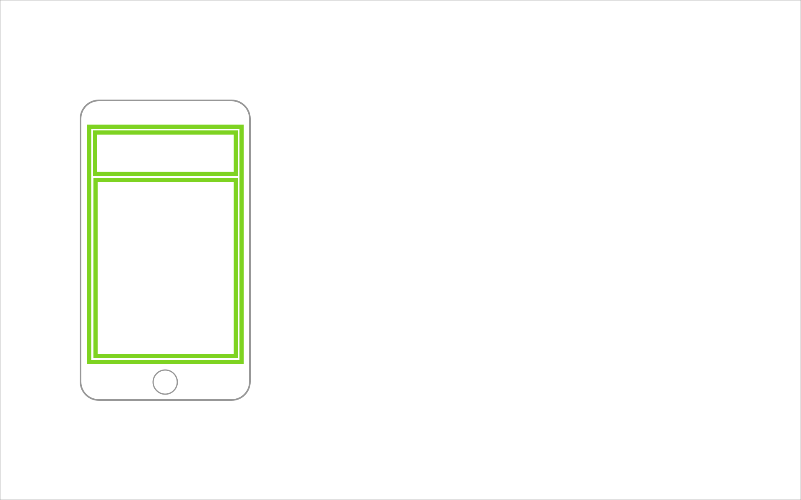
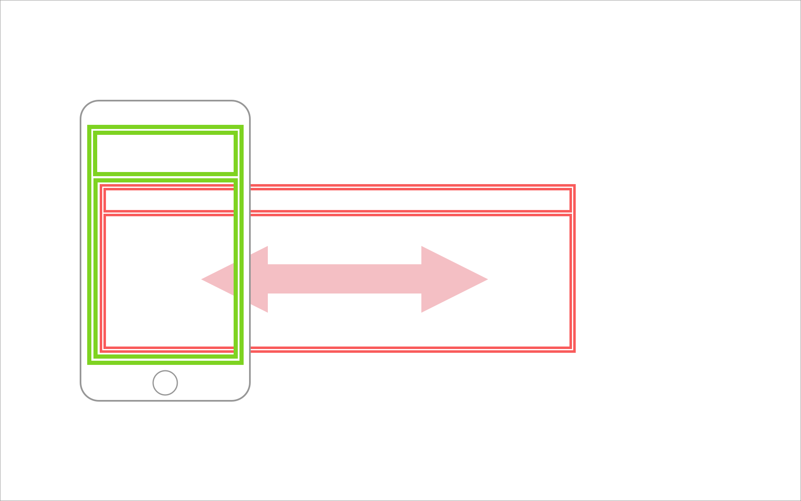
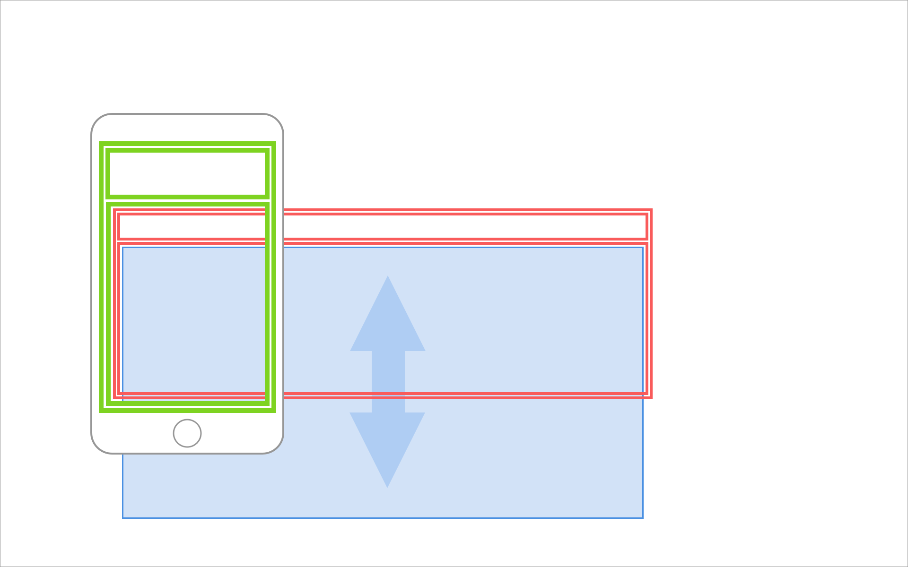
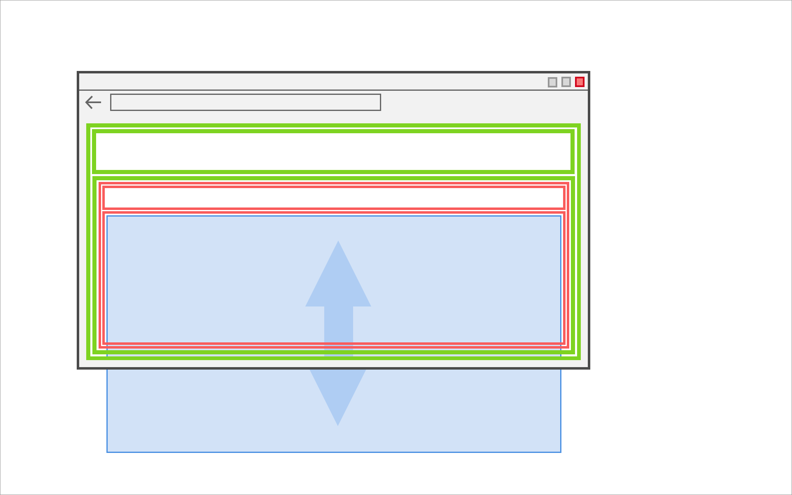
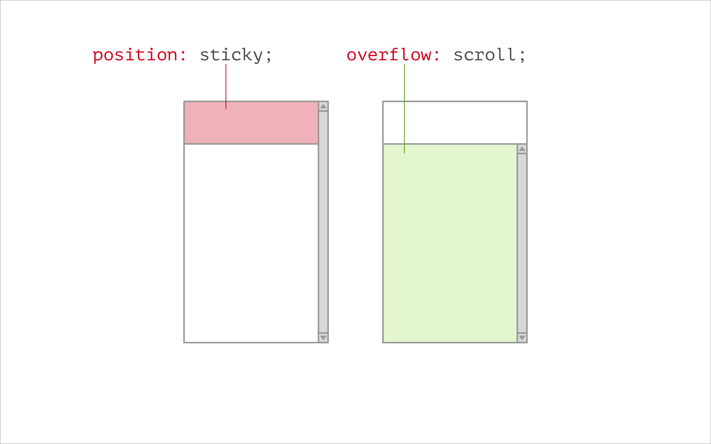
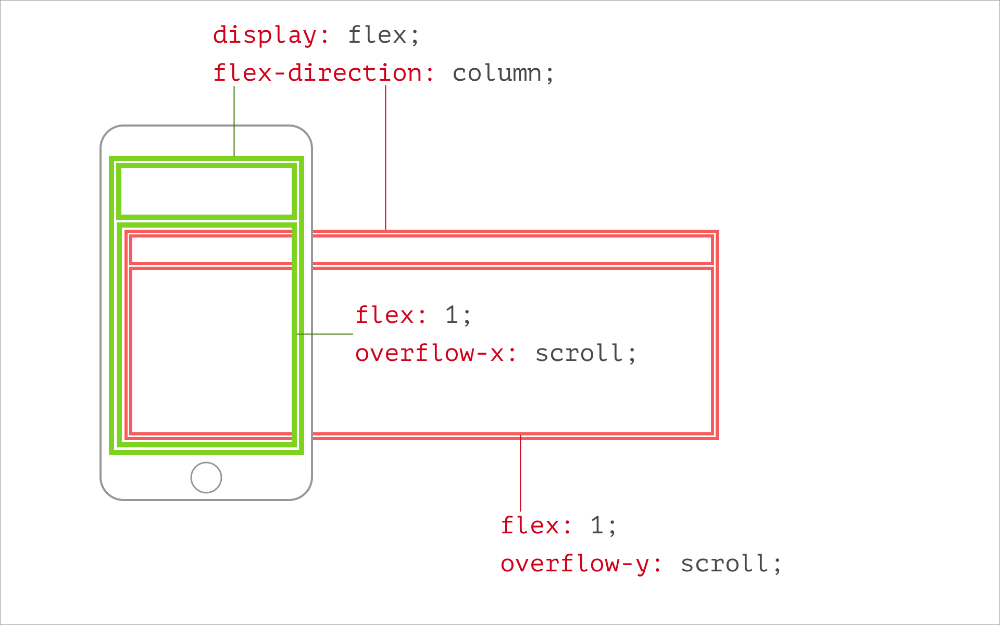
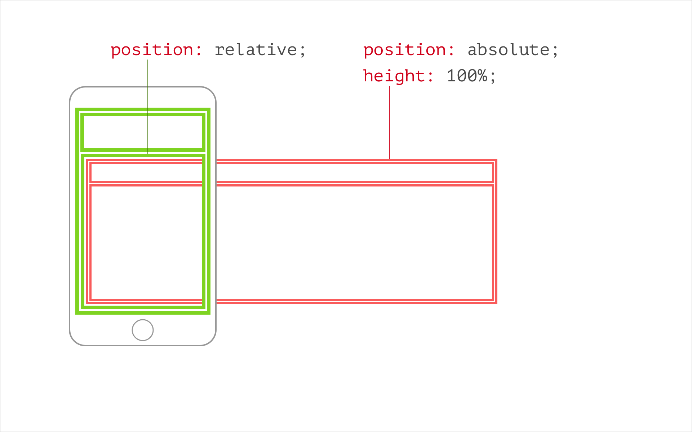
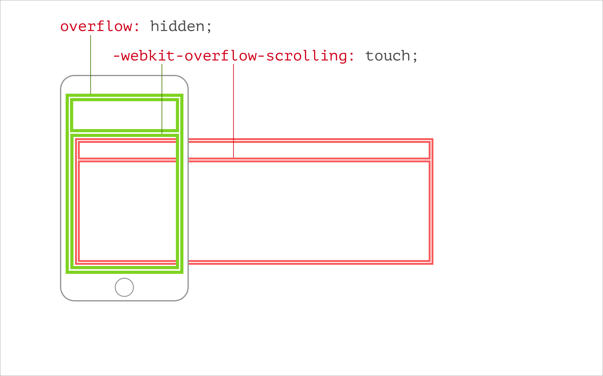

---

layout: yandex2

style: |
    /* собственные стили можно писать здесь!! */

---

# {:.logo}

## {{ site.presentation.title }}
{:.title}

### {{ site.presentation.service }}



{:.nda}




{{ site.author.name }}, {{ site.author.position }}





{{ site.author2.name }}, {{ site.author2.position }}



## Что вас ждет

1. {:.next}О задании
2. {:.next}Как сверстать
3. {:.next}Дополительные критерии
4. {:.next}Ответы на вопросы

## О задании
{:.section}

## 0. Нужно сверстать по макетам две страницы сервиса "Переговорки"
{:.fullscreen}

## 1. Адаптивная верстка
{:.fullscreen}

## 2. Кроссбраузерность
{:.fullscreen}

## 2. Кроссбраузерность
{:.fullscreen}

## 2. Кроссбраузерность
{:.fullscreen}

## Почему переговорки?
{:.section}

## Почему переговорки?
{:.fullscreen}

## Почему макеты?
{:.section}

## Дизайнеры
{:.images .three}

*Ольга Шанцева*

*Даша Мартынюк*

*Регина Смирнова*

## Черновики - десктоп
{:.fullscreen}

## Черновики - мобилки
{:.fullscreen}

## В итоге &mdash; сложные качественные макеты.
{:.blockquote}

## Как сверстать
{:.section}

## Общая разметка - схема1
{:.fullscreen}

## Общая разметка - схема2
{:.fullscreen}

## Общая разметка - схема3
{:.fullscreen}

## Схема решения - 00
{:.fullscreen}

## Схема решения - 01
{:.fullscreen}

## Схема решения - 02
{:.fullscreen}

## Схема решения - 03
{:.fullscreen}

## Схема решения - 04
{:.fullscreen}

## 2 способа
{:.fullscreen}

## Стили - 00
{:.fullscreen}

## Стили - 01
{:.fullscreen}

## [ngrok.com](https://ngrok.com/)  [localtunnel.github.io](https://localtunnel.github.io/www/)
{:.shout}

## Стили - 02 (моб)
{:.fullscreen}

## Шкала

## Названия переговорок

## Сотображение событий

## Страница редактирования

## Дополнительные критерии
{:.section}

## Организация и оформление кода

- разбить на части
- одинаковое оформление + прикрутить линтеры

## Автоматизация

автопрефиксер, препроцессоры и конкатенация, режимы для разработки и прода.

## Вопросы?
{:.section}

## Спасибо
{:.contacts}



<figure markdown="1">

### {{ site.author.name }}


{{ site.author.position }}


</figure>





<figure markdown="1">

### {{ site.author2.name }}


{{ site.author2.position }}


</figure>



<!-- разделитель контактов -->
-------

<!-- left -->
- {:.skype}dima117a
- {:.mail}dima117a@yandex-team.ru
- {:.github}dima117

<!-- right -->

<!-- 
- {:.twitter}@author
- {:.facebook}author
- {:.mail}author@yandex-team.ru
- {:.phone}+7-999-888-7766
- {:.github}author
- {:.bitbucket}author
- {:.twitter}@author
- {:.telegram}author
- {:.skype}author
- {:.instagram}author
- {:.facebook}author
- {:.vk}@author
- {:.ok}@author

-->
